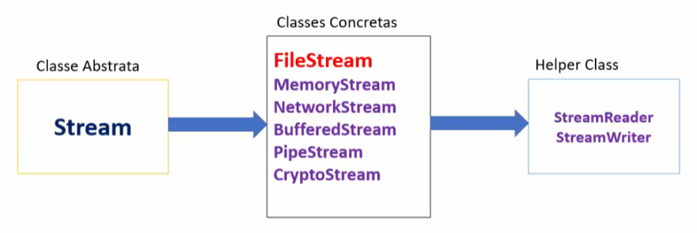

# FileStream

Fornece um *stream* para um arquivo, dando suporte a operações de leitura e gravação síncronas e assíncronas. Essa classe deriva da classe **Stream**.

| Propriedade | Descrição |
|--|--|
| CanRead | Indica se o stream atual oferece suporte à leitura |
| CanSeek | Indica se o stream atual oferece suporte a busca |
| IsAsync | Indica de o stream foi aberto de forma síncrona ou assíncrona |
| CanWrite | Indica se o stream oferece suporte a escrita |
| Length | Obtém o tamanho em bytes do stream |
| Position | Obtém ou define a posição no stream atual |
| Name | Obtém o caminho absoluto do arquivo aberto no FileStream |

A classe <u>Stream</u> é a classe base para todos os streams. Um stream é uma sequência de bytes que pode ser lida ou escrita em partes menores. 

| Método| Descrição |
| -- | -- |
| BeginRead | Inicia uma operação de leitura assíncrona. (Considere usar ReadAsync) |
| BeginWrite | Inicia uma operação de gravação assíncrona. (Considere usar WriteAsync) |
| Close | Fecha o stream atual e libera os recursos |
| CopyToAsync | Ler os bytes do stream atual e os escreve em outro stream de forma assíncrona |
| Dispose | Libera os recursos não gerenciados usados pelo Filestream |
| EndRead | A guarda a leitura assíncrona pendente terminar. (Considere usar ReadAsync) |
| EndWrite | Termina uma operação de gravação assíncrona. (Considere usar WriteAsync) | 
| Finalize | Permite que um objeto libere recursos e execute outras operações de limpeza antes que ele seja recuperado pela coleta de lixo |
| Flush | Limpa todos os buffers para o stream e faz com que alguns dados armazenados em buffer sejam gravados no arquivo |
| Read/ReadAsync | Lê uams equência de bytes do stream atual e avança a posição do stream pelo número de bytes lidos |
| Seek | Define a posição atual no stream para um dado valor | 
| SetLength | Define o comprimento de stream atual |
| Write/WriteAsync | Grava uma sequência de bytes no stream atual e avança a posição atual dentro do stream pelo número de bytes escritos. |

### StreamReader e StreamWrite

**StreamReader:** É uma classe auxiliar usada para ler caracteres de um Stream, convertendo bytes em caracteres usando um valor codificado e pode ser usada para ler strings (caracteres) de diferentes Streams como FileStream, MemoryStream, etc.

**StreamWriter:** É uma classe auxiliar usada para gravar uma string em um Stream, convertendo caracteres em bytes e pode ser usada para gravar strings em diferentes Streams, como FileStream, MemoryStream, etc.
